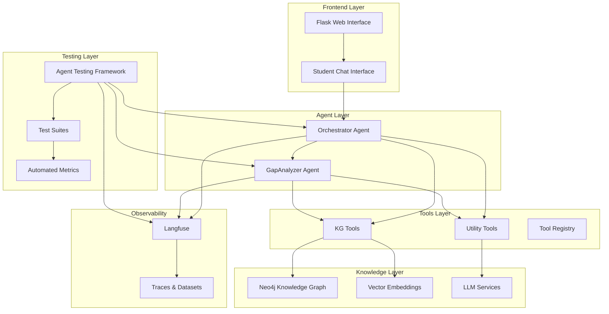

# Luca - GenAI Educational Learning Platform


*An intelligent, interactive tutor designed to revolutionize how students engage with their courses*

## 🎯 Overview

**Luca** is a sophisticated GenAI Learning Project that serves as an intelligent, interactive tutor designed to revolutionize how students engage with their courses. It combines a Neo4j knowledge graph with AI agents to provide personalized guidance and answers to complex questions about course materials.

### Key Features

- 🧠 **Knowledge Graph Intelligence**: Neo4j-powered structured course data with semantic search
- 🤖 **AI Agents Ecosystem**: Orchestrator and GapAnalyzer agents built with A2A framework
- 🌐 **Modern Web Frontend**: Flask-based web interface with conversation management
- 🧪 **Comprehensive Testing Framework**: Automated agent evaluation with Langfuse integration
- 📊 **Educational Gap Analysis**: Advanced identification and prioritization of learning gaps
- 🔧 **Centralized Tools**: Shared LangChain tools for consistent agent development
- 📈 **Complete Observability**: Langfuse integration for LLM monitoring and tracing
- 🔄 **Iterative Learning**: Feedback loops for continuous improvement

## 🏗️ System Architecture



## 🚀 Quick Start

### Prerequisites

- Python 3.12+
- Docker & Docker Compose
- Node.js (for mermaid-cli, optional)
- Neo4j plugins (APOC, GDS)

### 1. Environment Setup

```bash
# Clone the repository
git clone <repository-url>
cd luca

# Create and activate conda environment
conda create -n luca python=3.12
conda activate luca

# Install dependencies (preferred method)
uv sync
# OR
pip install -r requirements.txt
```

### 2. Environment Variables

Create a `.env` file or use direnv with `.envrc`:

```bash
# Neo4j Configuration
NEO4J_URI="bolt://localhost:7687"
NEO4J_USERNAME="neo4j"
NEO4J_PASSWORD="your_secure_password"

# OpenAI Configuration
OPENAI_API_KEY="sk-your-openai-api-key"

# LLM Configuration
DEFAULT_LLM_MODEL="gpt-4o-mini"
DEFAULT_LLM_PROVIDER="openai"
DEFAULT_LLM_TEMPERATURE="0.1"

# Langfuse Observability (Optional)
LANGFUSE_HOST="http://localhost:3000"
LANGFUSE_PUBLIC_KEY="pk-lf-your-public-key"
LANGFUSE_SECRET_KEY="sk-lf-your-secret-key"

# LLM Graph Builder API
GRAPHBUILDER_URI="http://127.0.0.1:8000/chat_bot"
```

### 3. Database Setup

```bash
cd db

# Create required directories
mkdir -p data plugins logs import

# Download Neo4j plugins to plugins/ directory:
# - neo4j-graph-data-science-2.13.2.jar
# - apoc-5.26.1-core.jar

# Set permissions (development only)
sudo chmod -R a+rw ./data ./plugins ./logs ./import

# Start Neo4j with Docker
docker run -d --env-file .env -p 7474:7474 -p 7687:7687 \
  -v ./data:/data -v ./logs:/logs -v ./import:/var/lib/neo4j/import \
  -v ./plugins:/plugins --name neo4j neo4j:5.26.1

# Create knowledge graph from Excel data
python create_kg.py
```

### 4. Start the Application

#### Option A: Flask Web Interface (Recommended)
```bash
# Start the Flask frontend
cd frontend
python run.py

# Access at http://localhost:5000
# Login: visitante@uca.edu.ar / visitante!
```

#### Option B: Individual Agents (Development)
```bash
# Start Orchestrator agent
python -m orchestrator --host localhost --port 10001

# Start GapAnalyzer agent  
python -m gapanalyzer --host localhost --port 10000

# Test agents
python orchestrator/test_client.py
python gapanalyzer/test_client.py
```

#### Option C: Agent Testing Framework
```bash
# Install testing dependencies
pip install langfuse click pydantic

# Run pre-built test suites
python -m agent-test.cli suite list
python -m agent-test.cli run orchestrator_basic_qa
python -m agent-test.cli results list
```

## 📚 Project Structure

```
luca/
├── docs/                      # 📖 Project documentation
├── frontend/                  # 🌐 Flask web interface
│   ├── flask_app.py           # Main Flask application
│   ├── auth.py                # User authentication & conversation management
│   ├── templates/             # Jinja2 templates
│   └── static/               # CSS, JS, and assets
├── agent-test/               # 🧪 Agent testing framework
│   ├── cli.py                # CLI interface
│   ├── core/                 # Core testing modules
│   ├── suites/               # JSON test suites
│   └── results/              # Test execution results
├── orchestrator/             # 🎯 Main conversation manager agent
│   ├── agent.py              # Core orchestrator implementation
│   ├── workflow.py           # LangGraph conversation workflow
│   ├── schemas.py            # Conversation data models
│   ├── agent_executor.py     # A2A framework integration
│   └── local_runner.py       # Development testing
├── gapanalyzer/             # 🔍 Educational gap analysis agent
│   ├── agent.py             # Core gap analysis implementation
│   ├── workflow.py          # LangGraph gap analysis workflow
│   ├── schemas.py           # Gap analysis data models
│   ├── agent_executor.py    # A2A framework integration
│   └── local_runner.py      # Development testing
├── kg/                      # 🔗 Knowledge Graph abstraction layer
│   ├── connection.py        # Neo4j connection management
│   ├── queries.py           # High-level query interface
│   └── example.py           # Usage examples
├── tools/                   # 🛠️ Centralized LangChain tools
│   ├── kg_tools.py          # Knowledge graph tools
│   ├── utility_tools.py     # General utility tools
│   ├── llm_config.py        # LLM configuration
│   ├── observability.py     # Langfuse integration
│   └── registry.py          # Tool registry & factory
├── db/                      # 💾 Database scripts and data
│   ├── create_kg.py         # Knowledge graph creation
│   ├── datasources/         # Excel data files
│   └── docker-compose.yml   # Database services
├── scripts/                 # 🔧 Utility scripts
│   └── cleanup_database.py  # Database maintenance
├── test/                    # 🧪 Unit test suite
└── CLAUDE.md               # 🤖 AI assistant instructions
```

## 🧩 Core Components

### Knowledge Graph Layer (`kg/`)

Provides a high-level abstraction for Neo4j interactions without exposing Cypher syntax to agents.

- **Connection Management**: Automatic connection handling with environment variables
- **Query Interface**: Functional interface for common operations
- **Error Handling**: Robust error handling and reconnection logic
- **Vector Search**: Support for semantic search with embeddings

### Centralized Tools (`tools/`)

Shared LangChain tools library for consistent agent development.

**Knowledge Graph Tools**:
- Subject and topic retrieval
- Practice exercise search
- Theoretical content generation
- Related content discovery

**Utility Tools**:
- Text processing and analysis
- Mathematical calculations
- Data formatting and validation
- Date/time operations

### AI Agents

All agents follow the A2A (Agent-to-Agent) framework pattern:

1. **Agent Class**: Core business logic with streaming responses
2. **Agent Executor**: A2A protocol integration and task management  
3. **Schemas**: Pydantic models for data validation
4. **Local Runner**: Development and debugging interface

### Orchestrator Agent

Main conversation manager that handles student interactions and coordinates with other agents.

**Key Features**:
- Intent classification for routing decisions
- Multi-turn conversation management with memory
- Educational subject context injection
- Seamless GapAnalyzer integration for specific practice questions
- Real-time streaming responses

### GapAnalyzer Agent

Specialized agent for analyzing learning gaps in practice exercises.

**Workflow Steps**:
1. `validate_context` - Validate educational context
2. `analyze_gaps` - Identify specific learning gaps
3. `evaluate_gaps` - Assess pedagogical relevance
4. `generate_response` - Create structured educational response

### Flask Frontend

Modern web interface providing:
- User authentication with UCA domain validation
- Conversation management and persistence
- Real-time chat with streaming responses  
- Educational subject selection
- Mathematical symbols panel for algebra queries

### Agent Testing Framework

Comprehensive testing system for agent evaluation:
- JSON-based test suite management
- Automated metrics collection
- Langfuse dataset integration
- Performance trend analysis
- CLI-based workflow for continuous testing

## 🔧 Development

### Adding New Agents

1. Create agent directory following the pattern
2. Implement core agent class with streaming support
3. Define Pydantic schemas for data validation
4. Create A2A executor for framework integration
5. Add local runner for development testing

### Using Centralized Tools

```python
from tools import get_kg_tools, get_utility_tools, create_observed_llm
from tools.registry import ToolRegistry

# Get LLM with observability
llm = create_observed_llm()

# Get tools by category
kg_tools = get_kg_tools()
utility_tools = get_utility_tools()

# Get tools for specific agent types
registry = ToolRegistry()
tutor_tools = registry.get_tools_for_agent("tutor")

# Create agent with tools
from langgraph.prebuilt import create_react_agent
agent = create_react_agent(llm, tools=kg_tools + utility_tools)
```

### Testing

#### Unit Tests
```bash
# Run all tests
pytest test/ -v

# Run with coverage
pytest test/ --cov=kg --cov-report=html

# Run specific test categories
pytest -m integration    # Integration tests
pytest -m "not slow"     # Skip slow tests
pytest -m tools          # Tools tests only
```

#### Agent Testing Framework
```bash
# Create test suite
python -m agent-test.cli suite create my_test --agent=orchestrator

# Add questions to suite
python -m agent-test.cli suite add-question my_test \
  --question="Test question" \
  --expected="Expected answer" \
  --subject="Test Subject"

# Run agent evaluation
python -m agent-test.cli run my_test

# Analyze results
python -m agent-test.cli results list
python -m agent-test.cli results show <run_id>
```

#### Frontend Testing
```bash
# Test Flask application components
cd frontend
python test_frontend.py

# Test security and authentication
python test_security.py
```

## 📊 Knowledge Graph Schema

The knowledge graph represents educational content with the following structure:

```
Materia (Subject)
├── Carrera (Career)
├── Profesor (Professor)
├── ObjetivoMateria (Subject Objectives)
└── UnidadTematica (Thematic Units)
    └── Tema (Topics)
        └── Practica (Practices)
            ├── Tip (Tips)
            └── SeccionPractica (Practice Sections)
                ├── Ejercicio (Exercises)
                │   ├── Respuesta (Answers)
                │   └── Tip (Tips)
                └── Tip (Tips)
```

All text nodes include vector embeddings using OpenAI's `text-embedding-ada-002` model for semantic search capabilities.

## 🔍 Observability & Monitoring

### Langfuse Integration

Complete LLM observability with automatic tracing:

```python
from tools.observability import create_observed_llm

# Create LLM with automatic tracing
llm = create_observed_llm()

# All LLM calls are automatically traced
response = llm.invoke("Your prompt here")
```

**Features**:
- Request/response tracing
- Token usage tracking  
- Error monitoring
- Session grouping
- Performance metrics
- Cost tracking

### Metrics & Monitoring

- **LLM Call Tracing**: All agent interactions with LLMs
- **Tool Usage**: Knowledge graph and utility tool usage
- **Agent Performance**: Response times and success rates
- **Error Tracking**: Comprehensive error logging and alerts

## 🚢 Deployment

### Docker Deployment

```bash
# Build the agent container
docker build -t luca-agent .

# Run the containerized agent
docker run -p 10000:10000 luca-agent
```

### Production Services

Use `docker-compose.yml` for complete production setup:

```bash
cd db
docker-compose up -d
```

Services included:
- Neo4j with GDS and APOC plugins
- LLM Graph Builder API
- Langfuse observability stack (PostgreSQL, Redis, ClickHouse)

## 🤝 Contributing

1. Follow the existing code patterns and architecture
2. Use centralized tools instead of creating new ones
3. Include comprehensive tests for new functionality
4. Update documentation for any new features
5. Use `create_observed_llm()` for LLM integration

### Code Standards

- **Type Hints**: All functions must include type hints
- **Pydantic Models**: Use for all data validation
- **Error Handling**: Implement robust error handling
- **Documentation**: Include docstrings and inline documentation
- **Testing**: Minimum 80% test coverage

## 📖 Documentation

- [Architecture Guide](./architecture.md) - Detailed system architecture
- [API Reference](./api-reference.md) - Complete API documentation
- [Development Guide](./development.md) - Development setup and guidelines
- [Deployment Guide](./deployment.md) - Production deployment instructions
- [Tool Reference](./tools.md) - Centralized tools documentation
- [Agent Development](./agents.md) - Guide for creating new agents

## 🔗 Related Resources

- [LangChain Documentation](https://python.langchain.com/)
- [LangGraph Documentation](https://langchain-ai.github.io/langgraph/)
- [Neo4j Documentation](https://neo4j.com/docs/)
- [A2A Framework](https://github.com/anthropics/a2a-sdk)
- [Langfuse Documentation](https://langfuse.com/docs)

## 📄 License

[Include license information here]

## 🆘 Support

For questions, issues, or contributions:

- 📧 Email: [contact-email]
- 💬 Discussions: [GitHub Discussions URL]
- 🐛 Issues: [GitHub Issues URL]
- 📖 Wiki: [Project Wiki URL]

---

Built with ❤️ using LangChain, Neo4j, and modern AI technologies.