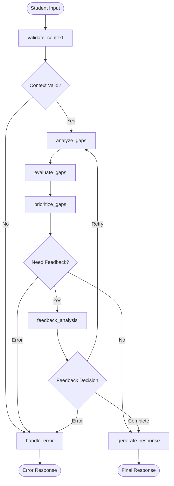

# Workflows and Processes

## 🔄 Overview

This document describes the LangGraph workflows, business processes, and operational procedures used throughout the Luca system. It covers workflow design patterns, state management, error handling, and integration patterns.

## 🎯 Workflow Architecture

### LangGraph Foundation

All workflows in Luca are built using LangGraph, providing:
- **State Management**: Pydantic-based state objects
- **Node Orchestration**: Declarative workflow definition
- **Conditional Logic**: Dynamic routing based on state
- **Error Recovery**: Robust error handling and retry mechanisms
- **Observability**: Built-in tracing and monitoring

### Workflow Design Patterns

#### 1. Linear Processing Pattern
```python
# Simple sequential workflow
workflow.add_edge("validate_input", "process_data")
workflow.add_edge("process_data", "generate_output")
workflow.add_edge("generate_output", END)
```

#### 2. Conditional Branching Pattern
```python
# Workflow with conditional logic
workflow.add_conditional_edges(
    "analyze_input",
    decision_function,
    {
        "simple": "simple_processing",
        "complex": "complex_processing",
        "error": "error_handler"
    }
)
```

#### 3. Feedback Loop Pattern
```python
# Iterative improvement workflow
workflow.add_conditional_edges(
    "quality_check",
    quality_gate,
    {
        "retry": "improve_result",
        "complete": "finalize_output",
        "fail": "error_handler"
    }
)
```

## 🔍 GapAnalyzer Workflow

### Complete Workflow Overview



### State Schema

```python
class WorkflowState(BaseModel):
    """State object for the gap analysis workflow"""
    
    # Input data
    student_context: Optional[StudentContext] = None
    
    # Retrieved context
    educational_context: Optional[EducationalContext] = None
    
    # Analysis results
    raw_gaps: List[IdentifiedGap] = Field(default=[])
    evaluated_gaps: List[GapEvaluation] = Field(default=[])
    prioritized_gaps: List[PrioritizedGap] = Field(default=[])
    
    # Final result
    final_result: Optional[GapAnalysisResult] = None
    
    # Workflow control
    error_message: Optional[str] = None
    should_retry: bool = False
    iteration_count: int = 0
    
    # Feedback loop control
    feedback_iterations: int = Field(default=0)
    max_feedback_iterations: int = Field(default=3)
    needs_feedback: bool = Field(default=False)
    feedback_reason: Optional[str] = Field(default=None)
```

### Workflow Nodes

#### 1. validate_context

**Purpose**: Validate and prepare educational context for analysis.

```python
async def _validate_context(self, state: WorkflowState) -> WorkflowState:
    """
    Validate educational context and determine if additional context is needed.
    
    Responsibilities:
    - Validate required fields in StudentContext
    - Check context completeness
    - Determine if theoretical context lookup is needed
    - Set up EducationalContext object
    """
    try:
        logger.info("Validating educational context")
        
        if not state.student_context:
            state.error_message = "No student context provided"
            return state
        
        ctx = state.student_context
        
        # Validate context completeness
        context_complete = True
        needs_theory = False
        
        if not ctx.practice_context or len(ctx.practice_context) < 20:
            context_complete = False
            logger.warning("Practice context appears incomplete")
        
        if not ctx.exercise_context or len(ctx.exercise_context) < 20:
            context_complete = False
            logger.warning("Exercise context appears incomplete")
        
        # Create educational context
        educational_context = EducationalContext(
            context_complete=context_complete,
            needs_theory_lookup=needs_theory
        )
        
        state.educational_context = educational_context
        logger.info(f"Educational context validated for {ctx.subject_name}")
        
    except Exception as e:
        logger.error(f"Error validating context: {e}")
        state.error_message = f"Failed to validate educational context: {str(e)}"
    
    return state
```

#### 2. analyze_gaps

**Purpose**: Identify specific learning gaps using LLM analysis.

```python
async def _analyze_gaps(self, state: WorkflowState) -> WorkflowState:
    """
    Analyze student question to identify specific learning gaps.
    
    Process:
    1. Construct detailed analysis prompt with educational context
    2. Send to LLM with structured output requirements
    3. Parse JSON response into IdentifiedGap objects
    4. Handle iteration context for feedback loops
    """
    try:
        logger.info("Analyzing learning gaps")
        
        # Create structured prompt for gap analysis
        analysis_prompt = ChatPromptTemplate.from_messages([
            ("system", """Eres un experto en análisis de gaps educativos...
            
CONTEXTO EDUCATIVO:
Materia: {subject_name}
{practice_context}
{exercise_context}
{solution_context}
{tips_context}
Teoría adicional: {theory_background}

ITERACIÓN: {iteration_info}

INSTRUCCIONES:
1. Analizá la pregunta del estudiante en contexto
2. Identificá gaps específicos de aprendizaje
3. Clasificá cada gap por categoría y severidad
4. Proporcioná evidencia específica
5. Identificá conceptos afectados

Respondé en formato JSON..."""),
            ("human", """PREGUNTA DEL ESTUDIANTE: {student_question}
HISTORIAL: {conversation_history}
Analizá esta pregunta e identificá los gaps específicos.""")
        ])
        
        # Format and send to LLM
        formatted_prompt = analysis_prompt.format_messages(...)
        response = await self.llm.ainvoke(formatted_prompt)
        
        # Parse JSON response
        gap_data = json.loads(extract_json(response.content))
        identified_gaps = [IdentifiedGap(**gap_dict) for gap_dict in gap_data["gaps"]]
        
        state.raw_gaps = identified_gaps
        logger.info(f"Identified {len(identified_gaps)} learning gaps")
        
    except Exception as e:
        logger.error(f"Error in gap analysis: {e}")
        state.error_message = f"Gap analysis failed: {str(e)}"
    
    return state
```

#### 3. evaluate_gaps

**Purpose**: Evaluate pedagogical relevance and importance of identified gaps.

```python
async def _evaluate_gaps(self, state: WorkflowState) -> WorkflowState:
    """
    Evaluate gaps for pedagogical relevance, impact, and addressability.
    
    Evaluation Criteria:
    - Pedagogical relevance (0-1): Relevance to current learning objectives
    - Impact on learning (0-1): Effect on overall learning progress
    - Addressability (0-1): How easily the gap can be addressed
    - Priority score: Weighted combination of above factors
    """
    try:
        logger.info("Evaluating gap relevance and importance")
        
        evaluation_prompt = ChatPromptTemplate.from_messages([
            ("system", """Sos un pedagogo experto evaluando gaps de aprendizaje.
            
Para cada gap, evaluá:
1. RELEVANCIA PEDAGÓGICA (0-1): ¿Relevancia para objetivos actuales?
2. IMPACTO EN APRENDIZAJE (0-1): ¿Impacto en progreso general?
3. DIRECCIONABILIDAD (0-1): ¿Facilidad para abordar el gap?

Priority score = (relevancia * 0.4 + impacto * 0.4 + direccionabilidad * 0.2)"""),
            ("human", """GAPS IDENTIFICADOS: {gaps_json}
Evalúa cada gap según los criterios pedagógicos.""")
        ])
        
        # Process gaps and generate evaluations
        gaps_for_eval = [gap.dict() for gap in state.raw_gaps]
        formatted_prompt = evaluation_prompt.format_messages(
            gaps_json=json.dumps(gaps_for_eval, ensure_ascii=False)
        )
        
        response = await self.llm.ainvoke(formatted_prompt)
        eval_data = json.loads(extract_json(response.content))
        
        evaluations = [GapEvaluation(**eval_dict) for eval_dict in eval_data["evaluations"]]
        state.evaluated_gaps = evaluations
        
        logger.info(f"Evaluated {len(evaluations)} gaps")
        
    except Exception as e:
        logger.error(f"Error in gap evaluation: {e}")
        state.error_message = f"Gap evaluation failed: {str(e)}"
    
    return state
```

#### 4. prioritize_gaps

**Purpose**: Rank gaps by priority and create final prioritized list.

```python
async def _prioritize_gaps(self, state: WorkflowState) -> WorkflowState:
    """
    Prioritize gaps by pedagogical importance.
    
    Process:
    1. Combine gaps with their evaluations
    2. Sort by priority score (highest first)
    3. Create PrioritizedGap objects with rankings
    4. No recommendation generation (handled by separate agent)
    """
    try:
        logger.info("Prioritizing gaps by pedagogical importance")
        
        # Create gap-evaluation pairs
        gap_eval_pairs = []
        for gap in state.raw_gaps:
            evaluation = next(
                (eval for eval in state.evaluated_gaps if eval.gap_id == gap.gap_id),
                None
            )
            if evaluation:
                gap_eval_pairs.append((gap, evaluation))
        
        # Sort by priority score (highest first)
        gap_eval_pairs.sort(key=lambda x: x[1].priority_score, reverse=True)
        
        # Create PrioritizedGap objects
        prioritized_gaps = []
        for i, (gap, evaluation) in enumerate(gap_eval_pairs):
            prioritized_gap = PrioritizedGap(
                gap=gap,
                evaluation=evaluation,
                rank=i + 1,
                recommended_actions=[]  # Empty - handled by separate agent
            )
            prioritized_gaps.append(prioritized_gap)
        
        state.prioritized_gaps = prioritized_gaps
        logger.info(f"Prioritized {len(prioritized_gaps)} gaps")
        
    except Exception as e:
        logger.error(f"Error in gap prioritization: {e}")
        state.error_message = f"Gap prioritization failed: {str(e)}"
    
    return state
```

#### 5. feedback_analysis

**Purpose**: Analyze quality and determine if another iteration is needed.

```python
async def _feedback_analysis(self, state: WorkflowState) -> WorkflowState:
    """
    Analyze current gap analysis quality and decide on iteration.
    
    Quality Checks:
    1. Number of gaps found (too few might indicate incomplete analysis)
    2. Gap description quality (superficial vs. detailed)
    3. Confidence scores (low scores suggest uncertainty)
    4. Context completeness (missing theoretical context)
    
    Iteration Decision:
    - Retry: Analysis needs improvement
    - Complete: Analysis is satisfactory
    - Error: Maximum iterations reached or critical error
    """
    try:
        logger.info(f"Performing feedback analysis - iteration {state.feedback_iterations + 1}")
        
        state.feedback_iterations += 1
        
        # Check if theoretical context is needed
        if (state.educational_context.needs_theory_lookup and 
            not state.educational_context.theory_background):
            
            # Retrieve theoretical context
            key_concepts = []
            for gap in state.raw_gaps:
                key_concepts.extend(gap.affected_concepts)
            
            if key_concepts:
                main_concept = max(set(key_concepts), key=key_concepts.count)
                theory_content = get_theoretical_content_tool.invoke({
                    "topic_description": main_concept
                })
                state.educational_context.theory_background = theory_content
                logger.info(f"Retrieved theoretical content for: {main_concept}")
        
        # Analyze gap quality
        if len(state.prioritized_gaps) == 0:
            state.feedback_reason = "No gaps found - needs deeper analysis"
            state.needs_feedback = True
        elif len(state.prioritized_gaps) < 2:
            single_gap = state.prioritized_gaps[0]
            if len(single_gap.gap.description) < 50:
                state.feedback_reason = "Gap seems superficial - needs detail"
                state.needs_feedback = True
            else:
                state.needs_feedback = False
        else:
            avg_priority = sum(pg.evaluation.priority_score for pg in state.prioritized_gaps) / len(state.prioritized_gaps)
            if avg_priority < 0.5:
                state.feedback_reason = "Low confidence - refining analysis"
                state.needs_feedback = True
            else:
                state.needs_feedback = False
        
        logger.info(f"Feedback analysis complete. Needs feedback: {state.needs_feedback}")
        
    except Exception as e:
        logger.error(f"Error in feedback analysis: {e}")
        state.error_message = f"Error en análisis de feedback: {str(e)}"
    
    return state
```

#### 6. generate_response

**Purpose**: Create final structured response with analysis results.

```python
async def _generate_response(self, state: WorkflowState) -> WorkflowState:
    """
    Generate final structured response.
    
    Response Components:
    1. Executive summary of analysis
    2. Confidence score calculation
    3. General recommendations
    4. Complete GapAnalysisResult object
    """
    try:
        logger.info("Generating final response")
        
        # Calculate confidence score
        confidence_factors = []
        
        # Factor 1: Number of gaps found
        gap_count = len(state.prioritized_gaps)
        if gap_count >= 3:
            confidence_factors.append(0.9)
        elif gap_count >= 2:
            confidence_factors.append(0.8)
        elif gap_count >= 1:
            confidence_factors.append(0.7)
        else:
            confidence_factors.append(0.4)
        
        # Factor 2: Educational context quality
        if state.educational_context:
            confidence_factors.append(0.9)
        else:
            confidence_factors.append(0.6)
        
        # Factor 3: Evaluation completeness
        if len(state.evaluated_gaps) == len(state.raw_gaps):
            confidence_factors.append(0.9)
        else:
            confidence_factors.append(0.7)
        
        confidence_score = sum(confidence_factors) / len(confidence_factors)
        
        # Generate summary
        if state.prioritized_gaps:
            top_gap = state.prioritized_gaps[0]
            summary = f"Se identificaron {len(state.prioritized_gaps)} gaps de aprendizaje. "
            summary += f"El gap de mayor prioridad es: {top_gap.gap.title}"
        else:
            summary = "No se identificaron gaps específicos de aprendizaje."
        
        # Create final result
        final_result = GapAnalysisResult(
            student_context=state.student_context,
            educational_context=state.educational_context,
            identified_gaps=[pg.gap for pg in state.prioritized_gaps],
            prioritized_gaps=state.prioritized_gaps,
            summary=summary,
            confidence_score=confidence_score,
            recommendations=[
                "Revisar los conceptos teóricos relacionados con el ejercicio",
                "Consultar los tips proporcionados por el profesor",
                "Practicar con ejercicios similares de menor complejidad"
            ]
        )
        
        state.final_result = final_result
        logger.info("Generated complete gap analysis result")
        
    except Exception as e:
        logger.error(f"Error generating final response: {e}")
        state.error_message = f"Failed to generate final response: {str(e)}"
    
    return state
```

### Conditional Logic Functions

#### Decision Functions

```python
def _should_continue(self, state: WorkflowState) -> str:
    """Determine if workflow should continue or handle error."""
    if state.error_message:
        return "error"
    return "continue"

def _should_do_feedback(self, state: WorkflowState) -> str:
    """Determine if feedback analysis is needed."""
    if state.error_message:
        return "error"
    
    # Check feedback conditions
    if (state.feedback_iterations < state.max_feedback_iterations and
        len(state.prioritized_gaps) > 0):
        
        # Analyze confidence
        avg_confidence = sum(pg.evaluation.priority_score for pg in state.prioritized_gaps) / len(state.prioritized_gaps)
        
        if avg_confidence < 0.6 or state.educational_context.needs_theory_lookup:
            state.needs_feedback = True
            state.feedback_reason = "Baja confianza en análisis o falta contexto teórico"
            return "feedback"
    
    return "complete"

def _feedback_decision(self, state: WorkflowState) -> str:
    """Decide whether to retry analysis or complete."""
    if state.error_message:
        return "error"
    
    if state.needs_feedback and state.feedback_iterations < state.max_feedback_iterations:
        return "retry"
    
    return "complete"
```

## 🏗️ Workflow Development Patterns

### Creating New Workflows

#### 1. Define State Schema

```python
from pydantic import BaseModel, Field
from typing import Optional, List, Any

class MyWorkflowState(BaseModel):
    """State for custom workflow"""
    
    # Input data
    input_data: Optional[str] = None
    
    # Processing state
    processed_data: Optional[Any] = None
    intermediate_results: List[str] = Field(default=[])
    
    # Output
    final_result: Optional[str] = None
    
    # Control flow
    error_message: Optional[str] = None
    retry_count: int = 0
    max_retries: int = 3
    
    class Config:
        arbitrary_types_allowed = True
```

#### 2. Implement Node Functions

```python
async def process_input_node(state: MyWorkflowState) -> MyWorkflowState:
    """Process initial input"""
    try:
        if not state.input_data:
            state.error_message = "No input data provided"
            return state
        
        # Process input
        processed = process_data(state.input_data)
        state.processed_data = processed
        
        logger.info("Input processed successfully")
        
    except Exception as e:
        logger.error(f"Error processing input: {e}")
        state.error_message = f"Input processing failed: {str(e)}"
    
    return state

async def analyze_data_node(state: MyWorkflowState) -> MyWorkflowState:
    """Analyze processed data"""
    try:
        if not state.processed_data:
            state.error_message = "No processed data available"
            return state
        
        # Perform analysis
        analysis_result = analyze(state.processed_data)
        state.intermediate_results.append(analysis_result)
        
        logger.info("Data analysis completed")
        
    except Exception as e:
        logger.error(f"Error in data analysis: {e}")
        state.error_message = f"Data analysis failed: {str(e)}"
    
    return state
```

#### 3. Build Workflow Graph

```python
from langgraph.graph import StateGraph, END

def create_my_workflow():
    """Create custom workflow"""
    workflow = StateGraph(MyWorkflowState)
    
    # Add nodes
    workflow.add_node("process_input", process_input_node)
    workflow.add_node("analyze_data", analyze_data_node)
    workflow.add_node("generate_output", generate_output_node)
    workflow.add_node("handle_error", handle_error_node)
    
    # Set entry point
    workflow.set_entry_point("process_input")
    
    # Add edges
    workflow.add_conditional_edges(
        "process_input",
        lambda state: "error" if state.error_message else "continue",
        {
            "continue": "analyze_data",
            "error": "handle_error"
        }
    )
    
    workflow.add_conditional_edges(
        "analyze_data",
        lambda state: "error" if state.error_message else "continue", 
        {
            "continue": "generate_output",
            "error": "handle_error"
        }
    )
    
    workflow.add_edge("generate_output", END)
    workflow.add_edge("handle_error", END)
    
    return workflow.compile()
```

### Error Handling Patterns

#### Retry Logic

```python
def should_retry(state: MyWorkflowState) -> str:
    """Determine if operation should be retried"""
    if state.error_message and state.retry_count < state.max_retries:
        if "timeout" in state.error_message.lower():
            return "retry"
        elif "rate_limit" in state.error_message.lower():
            return "retry_with_delay"
    
    return "fail"

async def retry_with_backoff(state: MyWorkflowState) -> MyWorkflowState:
    """Retry with exponential backoff"""
    import asyncio
    
    state.retry_count += 1
    delay = 2 ** state.retry_count  # Exponential backoff
    
    logger.info(f"Retrying in {delay} seconds (attempt {state.retry_count})")
    await asyncio.sleep(delay)
    
    # Clear error to retry
    state.error_message = None
    
    return state
```

#### Circuit Breaker Pattern

```python
class CircuitBreaker:
    """Circuit breaker for external service calls"""
    
    def __init__(self, failure_threshold: int = 5, timeout: int = 60):
        self.failure_threshold = failure_threshold
        self.timeout = timeout
        self.failure_count = 0
        self.last_failure_time = None
        self.state = "CLOSED"  # CLOSED, OPEN, HALF_OPEN
    
    def can_execute(self) -> bool:
        """Check if operation can be executed"""
        if self.state == "CLOSED":
            return True
        elif self.state == "OPEN":
            if time.time() - self.last_failure_time > self.timeout:
                self.state = "HALF_OPEN"
                return True
            return False
        else:  # HALF_OPEN
            return True
    
    def record_success(self):
        """Record successful operation"""
        self.failure_count = 0
        self.state = "CLOSED"
    
    def record_failure(self):
        """Record failed operation"""
        self.failure_count += 1
        self.last_failure_time = time.time()
        
        if self.failure_count >= self.failure_threshold:
            self.state = "OPEN"
```

## 🔄 Integration Patterns

### A2A Framework Integration

#### Streaming Response Pattern

```python
async def stream_workflow_progress(
    workflow: CompiledGraph,
    initial_state: WorkflowState,
    context_id: str
) -> AsyncIterable[Dict[str, Any]]:
    """Stream workflow execution progress"""
    
    config = {"configurable": {"thread_id": context_id}}
    
    try:
        # Stream workflow execution
        async for event in workflow.astream(initial_state, config):
            for node_name, node_output in event.items():
                if node_name == "__start__":
                    continue
                
                # Yield progress update
                yield {
                    "is_task_complete": False,
                    "require_user_input": False,
                    "content": f"Executing {node_name}...",
                    "node_name": node_name,
                    "progress": calculate_progress(node_name)
                }
                
                # Check for errors
                if hasattr(node_output, 'error_message') and node_output.error_message:
                    yield {
                        "is_task_complete": False,
                        "require_user_input": True,
                        "content": f"Error in {node_name}: {node_output.error_message}"
                    }
                    return
        
        # Get final result
        final_state = await workflow.ainvoke(initial_state, config)
        
        yield {
            "is_task_complete": True,
            "require_user_input": False,
            "content": format_final_result(final_state),
            "final_state": final_state
        }
        
    except Exception as e:
        logger.error(f"Workflow execution error: {e}")
        yield {
            "is_task_complete": False,
            "require_user_input": True,
            "content": f"Workflow execution failed: {str(e)}"
        }
```

### Database Integration

#### Knowledge Graph Interaction

```python
async def enrich_with_kg_data(state: WorkflowState) -> WorkflowState:
    """Enrich workflow state with knowledge graph data"""
    try:
        from tools import get_kg_tools
        
        kg_tools = get_kg_tools()
        search_tool = next(tool for tool in kg_tools if tool.name == "search_knowledge_graph")
        
        # Extract search query from state
        search_query = extract_search_terms(state.student_context.student_question)
        
        # Search knowledge graph
        kg_results = search_tool.invoke({
            "query": search_query,
            "limit": 10,
            "search_type": "semantic"
        })
        
        # Parse and integrate results
        results_data = json.loads(kg_results)
        state.educational_context.kg_results = results_data["results"]
        
        logger.info(f"Retrieved {len(results_data['results'])} KG results")
        
    except Exception as e:
        logger.error(f"Error enriching with KG data: {e}")
        # Don't fail workflow for enrichment errors
        state.educational_context.kg_results = []
    
    return state
```

## 📊 Workflow Monitoring

### Performance Metrics

```python
import time
from typing import Dict, Any

class WorkflowMetrics:
    """Collect and track workflow performance metrics"""
    
    def __init__(self):
        self.node_times: Dict[str, float] = {}
        self.total_time: float = 0
        self.error_count: int = 0
        self.retry_count: int = 0
    
    def start_node(self, node_name: str):
        """Start timing a workflow node"""
        self.node_times[f"{node_name}_start"] = time.time()
    
    def end_node(self, node_name: str):
        """End timing a workflow node"""
        start_time = self.node_times.get(f"{node_name}_start")
        if start_time:
            duration = time.time() - start_time
            self.node_times[node_name] = duration
    
    def record_error(self):
        """Record a workflow error"""
        self.error_count += 1
    
    def record_retry(self):
        """Record a retry attempt"""
        self.retry_count += 1
    
    def get_summary(self) -> Dict[str, Any]:
        """Get metrics summary"""
        return {
            "total_time": self.total_time,
            "node_times": {k: v for k, v in self.node_times.items() if not k.endswith("_start")},
            "error_count": self.error_count,
            "retry_count": self.retry_count,
            "success_rate": 1 - (self.error_count / max(1, self.error_count + 1))
        }
```

### Observability Integration

```python
async def instrumented_workflow_node(
    node_func,
    state: WorkflowState,
    node_name: str,
    metrics: WorkflowMetrics
) -> WorkflowState:
    """Wrapper for workflow nodes with observability"""
    
    metrics.start_node(node_name)
    
    try:
        # Execute node with Langfuse tracing
        with langfuse_context(
            name=f"workflow_node_{node_name}",
            metadata={
                "workflow": "gap_analysis",
                "node": node_name,
                "iteration": getattr(state, 'iteration_count', 0)
            }
        ):
            result = await node_func(state)
            
        metrics.end_node(node_name)
        
        # Log success
        logger.info(f"Node {node_name} completed successfully")
        
        return result
        
    except Exception as e:
        metrics.end_node(node_name)
        metrics.record_error()
        
        # Log error with context
        logger.error(
            f"Node {node_name} failed",
            extra={
                "error": str(e),
                "node": node_name,
                "state_summary": summarize_state(state)
            }
        )
        
        # Update state with error
        state.error_message = f"Node {node_name} failed: {str(e)}"
        return state
```

This workflows documentation provides comprehensive coverage of workflow design, implementation patterns, and integration strategies used throughout the Luca system.